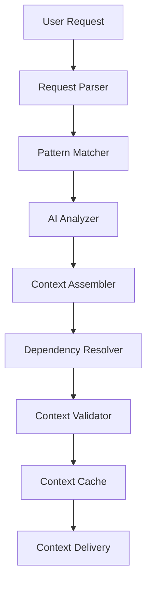
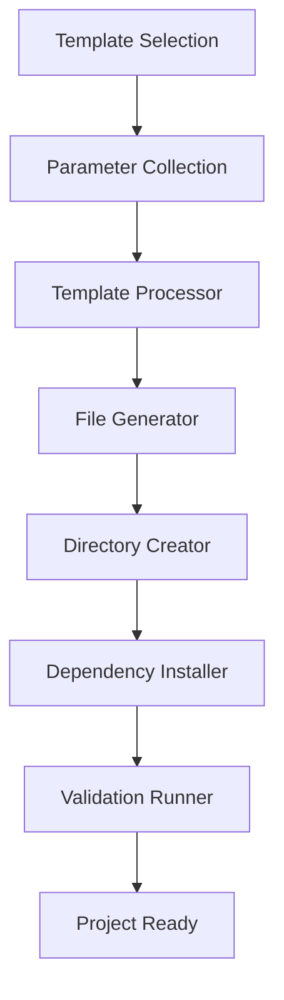
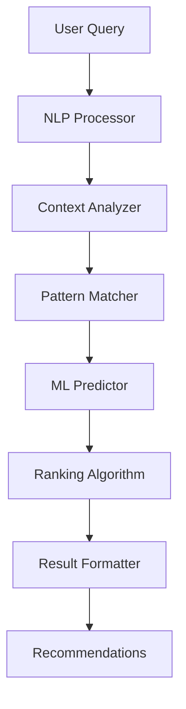

# 🏗️ System Architecture Overview - Архитектура СЛК

> **Целевая аудитория:** Разработчики, архитекторы, технические лидеры

## 📋 Содержание

1. [🎯 Архитектурное видение](#-архитектурное-видение)
2. [🏛️ Высокоуровневая архитектура](#️-высокоуровневая-архитектура)
3. [🧩 Основные компоненты](#-основные-компоненты)
4. [🔄 Потоки данных](#-потоки-данных)
5. [📦 Модульная структура](#-модульная-структура)
6. [🤖 AI Integration Layer](#-ai-integration-layer)
7. [🔧 Extensibility Points](#-extensibility-points)
8. [⚡ Performance Architecture](#-performance-architecture)
9. [🛡️ Security Architecture](#️-security-architecture)
10. [📊 Monitoring & Observability](#-monitoring--observability)

---

## 🎯 Архитектурное видение

### 🌟 Миссия архитектуры

**Smart Layered Context** спроектирована как **интеллектуальная система управления контекстом** с принципами:

- **🧠 AI-First:** Архитектура оптимизирована для работы с AI-ассистентами
- **📋 Layered Context:** Многослойная система контекста с четкой иерархией
- **🔄 Zero Duplication:** Принцип единой точки истины для всех данных
- **⚡ Performance-Oriented:** Быстрая загрузка и обработка контекста
- **🔧 Extensible:** Легкое расширение через плагины и модули

### 🎯 Ключевые архитектурные принципы

#### **1. Separation of Concerns**
```
🔸 Context Layer - управление контекстом
🔸 Template Layer - система шаблонов
🔸 Intelligence Layer - AI и ML компоненты
🔸 CLI Layer - пользовательский интерфейс
🔸 Storage Layer - персистентность данных
```

#### **2. Plugin Architecture**
- Модульная система с четкими интерфейсами
- Горячее подключение/отключение компонентов
- Dependency injection для слабой связанности

#### **3. Event-Driven Design**
- Асинхронная обработка событий
- Pub/Sub паттерн для inter-component communication
- Reactive streams для real-time updates

---

## 🏛️ Высокоуровневая архитектура

### 📊 Архитектурная диаграмма

```
┌─────────────────────────────────────────────────────────────┐
│                    USER INTERFACE LAYER                     │
├─────────────────────────────────────────────────────────────┤
│  CLI Interface  │  Cursor IDE  │  API Gateway  │  Web UI    │
└─────────────────┴──────────────┴───────────────┴────────────┘
                              │
┌─────────────────────────────────────────────────────────────┐
│                   APPLICATION LAYER                         │
├─────────────────────────────────────────────────────────────┤
│           Command Orchestrator & Business Logic             │
└─────────────────────────────────────────────────────────────┘
                              │
┌─────────────────────────────────────────────────────────────┐
│                    INTELLIGENCE LAYER                       │
├─────────────────────────────────────────────────────────────┤
│  Context AI  │  Template AI  │  Recommendation  │  Analytics│
└─────────────────────────────────────────────────────────────┘
                              │
┌─────────────────────────────────────────────────────────────┐
│                      CORE LAYER                             │
├─────────────────────────────────────────────────────────────┤
│ Context Mgr │ Template Mgr │ Task Mgr │ Evolution Mgr │ Org │
└─────────────────────────────────────────────────────────────┘
                              │
┌─────────────────────────────────────────────────────────────┐
│                    STORAGE LAYER                            │
├─────────────────────────────────────────────────────────────┤
│   JSON Store   │   File System   │   Cache   │   Analytics  │
└─────────────────────────────────────────────────────────────┘
```

### 🔄 Архитектурные паттерны

#### **1. Layered Architecture**
- **Presentation Layer:** CLI, Web UI, IDE интеграции
- **Application Layer:** Business logic, orchestration
- **Domain Layer:** Core business entities и rules
- **Infrastructure Layer:** Storage, external services

#### **2. Plugin Architecture**
- **Core System:** Базовая функциональность
- **Plugin Registry:** Управление плагинами
- **Extension Points:** Четко определенные точки расширения
- **Plugin Lifecycle:** Load, initialize, execute, unload

#### **3. Event-Driven Architecture**
- **Event Bus:** Центральная шина событий
- **Event Handlers:** Обработчики специфичных событий
- **Event Store:** Персистентность событий для аудита
- **Reactive Streams:** Real-time обновления UI

---

## 🧩 Основные компоненты

### 🧠 Context Management System

#### **Context Manager**
```python
class ContextManager:
    """Центральный менеджер контекста"""
    
    def __init__(self):
        self.context_loader = ContextLoader()
        self.context_cache = ContextCache()
        self.context_validator = ContextValidator()
    
    async def load_context(self, request: ContextRequest) -> Context:
        """Интеллектуальная загрузка контекста"""
        
    async def optimize_context(self, context: Context) -> Context:
        """Оптимизация размера контекста"""
        
    async def validate_context(self, context: Context) -> ValidationResult:
        """Валидация целостности контекста"""
```

#### **Context Loader**
- **Intelligent Loading:** AI-powered анализ запросов
- **Pattern Matching:** Сопоставление с базой паттернов
- **Dependency Resolution:** Автоматическое разрешение зависимостей
- **Caching Strategy:** Многоуровневое кэширование

### 📋 Template Management System

#### **Template Manager**
```python
class TemplateManager:
    """Система управления шаблонами"""
    
    def __init__(self):
        self.template_registry = TemplateRegistry()
        self.template_generator = TemplateGenerator()
        self.template_validator = TemplateValidator()
    
    async def create_project(self, template: Template, config: ProjectConfig) -> Project:
        """Создание проекта из шаблона"""
        
    async def generate_adaptive_template(self, context: Context) -> Template:
        """AI-генерация адаптивного шаблона"""
        
    async def validate_template(self, template: Template) -> ValidationResult:
        """Валидация структуры шаблона"""
```

#### **Template Categories**
```
🤖 AI/ML Templates (11)
├── ai_agent_development.json
├── prompt_engineering.json
├── fine_tuning_workflow.json
└── ...

💻 Language Templates (8)
├── python/python_development.json
├── javascript/javascript_development.json
├── c/c_development_enhanced.json
└── ...

📋 Methodology Templates (6)
├── documentation_systems.json
├── obsidian_workflow.json
├── defi_security_audit.json
└── ...
```

### 🎯 Task Management System

#### **Task Manager**
```python
class TaskManager:
    """Система управления задачами"""
    
    def __init__(self):
        self.task_scheduler = TaskScheduler()
        self.task_executor = TaskExecutor()
        self.task_monitor = TaskMonitor()
    
    async def create_task(self, task_def: TaskDefinition) -> Task:
        """Создание новой задачи"""
        
    async def execute_task(self, task: Task) -> TaskResult:
        """Выполнение задачи"""
        
    async def monitor_tasks(self) -> List[TaskStatus]:
        """Мониторинг статуса задач"""
```

### 🧠 Intelligence Layer

#### **AI Recommendation Engine**
```python
class RecommendationEngine:
    """AI движок рекомендаций"""
    
    def __init__(self):
        self.pattern_analyzer = PatternAnalyzer()
        self.ml_predictor = MLPredictor()
        self.context_analyzer = ContextAnalyzer()
    
    async def get_recommendations(self, query: str, context: Context) -> List[Recommendation]:
        """Получение AI рекомендаций"""
        
    async def analyze_usage_patterns(self, history: UsageHistory) -> PatternAnalysis:
        """Анализ паттернов использования"""
        
    async def predict_next_action(self, current_state: SystemState) -> ActionPrediction:
        """Предсказание следующего действия"""
```

---

## 🔄 Потоки данных

### 📊 Context Loading Flow



### 🔄 Template Creation Flow



### 🧠 AI Recommendation Flow



---

## 📦 Модульная структура

### 🗂️ Файловая архитектура

```
.context/
├── modules/                    # Модули контекста
│   ├── core/                  # Базовые модули
│   │   ├── manifest.json      # Главный манифест
│   │   ├── standards.json     # Стандарты разработки
│   │   └── project.json       # Информация о проекте
│   ├── ai_ml/                 # AI/ML модули
│   ├── languages/             # Языковые модули
│   ├── methodologies/         # Методологические модули
│   ├── tools/                 # Инструментальные модули
│   └── projects/              # Проектные модули
├── tasks/                     # Система задач
├── tools/                     # CLI и автоматизация
│   ├── scripts/               # Исполняемые скрипты
│   └── cli_modules/           # CLI модули
└── docs/                      # Документация
    ├── user/                  # Пользовательская документация
    ├── admin/                 # Администраторская документация
    ├── developer/             # Документация разработчика
    └── research/              # Исследовательская документация
```

### 🔧 Кодовая архитектура

```
src/
├── core/                      # Ядро системы
│   ├── context/               # Управление контекстом
│   ├── templates/             # Система шаблонов
│   ├── tasks/                 # Управление задачами
│   └── intelligence/          # AI компоненты
├── cli/                       # CLI интерфейс
│   ├── commands/              # CLI команды
│   ├── parsers/               # Парсеры аргументов
│   └── formatters/            # Форматеры вывода
├── api/                       # API интерфейс
│   ├── rest/                  # REST API
│   ├── graphql/               # GraphQL API
│   └── websocket/             # WebSocket API
├── integrations/              # Внешние интеграции
│   ├── cursor/                # Cursor IDE
│   ├── vscode/                # VS Code
│   └── github/                # GitHub
├── storage/                   # Слой хранения
│   ├── json/                  # JSON хранилище
│   ├── cache/                 # Система кэширования
│   └── analytics/             # Аналитические данные
└── utils/                     # Утилиты
    ├── validation/            # Валидация
    ├── serialization/         # Сериализация
    └── logging/               # Логирование
```

---

## 🤖 AI Integration Layer

### 🧠 AI Architecture Components

#### **1. Natural Language Processing**
```python
class NLPProcessor:
    """Обработка естественного языка"""
    
    def analyze_intent(self, query: str) -> Intent:
        """Анализ намерения пользователя"""
        
    def extract_entities(self, query: str) -> List[Entity]:
        """Извлечение сущностей из запроса"""
        
    def classify_request(self, query: str) -> RequestType:
        """Классификация типа запроса"""
```

#### **2. Pattern Recognition**
```python
class PatternMatcher:
    """Система распознавания паттернов"""
    
    def match_patterns(self, query: str, context: Context) -> List[Pattern]:
        """Сопоставление с известными паттернами"""
        
    def learn_pattern(self, interaction: UserInteraction) -> Pattern:
        """Обучение на новых паттернах"""
        
    def update_patterns(self, feedback: UserFeedback) -> None:
        """Обновление паттернов на основе обратной связи"""
```

#### **3. Machine Learning Pipeline**
```python
class MLPipeline:
    """ML пайплайн для рекомендаций"""
    
    def train_model(self, training_data: TrainingData) -> Model:
        """Обучение модели"""
        
    def predict(self, features: Features) -> Prediction:
        """Предсказание на основе признаков"""
        
    def evaluate_model(self, test_data: TestData) -> ModelMetrics:
        """Оценка качества модели"""
```

### 🔗 AI Integration Points

#### **1. Cursor IDE Integration**
- **Auto Context Loading:** `@.context/manifest.json`
- **Command Translation:** Русские команды → CLI команды
- **JSON Context:** Структурированный контекст для AI
- **Real-time Suggestions:** Динамические рекомендации

#### **2. External AI APIs**
- **OpenAI GPT:** Для генерации контента и анализа
- **Anthropic Claude:** Для сложного reasoning
- **Local Models:** Для приватности и скорости
- **Custom Models:** Специализированные модели

---

## 🔧 Extensibility Points

### 🔌 Plugin System Architecture

#### **Plugin Interface**
```python
class SLCPlugin(ABC):
    """Базовый интерфейс плагина"""
    
    @abstractmethod
    def initialize(self, context: PluginContext) -> None:
        """Инициализация плагина"""
        
    @abstractmethod
    def execute(self, request: PluginRequest) -> PluginResponse:
        """Выполнение функции плагина"""
        
    @abstractmethod
    def cleanup(self) -> None:
        """Очистка ресурсов плагина"""
```

#### **Extension Points**
```python
# 1. Context Loading Extensions
class ContextLoaderPlugin(SLCPlugin):
    def load_context(self, request: ContextRequest) -> Context:
        """Кастомная загрузка контекста"""

# 2. Template Processing Extensions  
class TemplateProcessorPlugin(SLCPlugin):
    def process_template(self, template: Template) -> ProcessedTemplate:
        """Кастомная обработка шаблонов"""

# 3. AI Integration Extensions
class AIIntegrationPlugin(SLCPlugin):
    def get_recommendations(self, query: str) -> List[Recommendation]:
        """Кастомные AI рекомендации"""

# 4. Storage Extensions
class StoragePlugin(SLCPlugin):
    def store_data(self, data: Any, key: str) -> None:
        """Кастомное хранение данных"""
```

### 🎯 Customization Points

#### **1. Command Extensions**
```bash
# Регистрация новой команды
./slc plugin register-command "my-command" --handler "MyCommandHandler"

# Создание алиаса
./slc config alias "быстрый-деплой" "deploy --fast --env production"
```

#### **2. Template Extensions**
```json
{
  "template_info": {
    "name": "Custom FastAPI Template",
    "extends": "languages/python/python_development.json",
    "customizations": {
      "additional_dependencies": ["fastapi", "uvicorn"],
      "custom_structure": {
        "api/": ["endpoints/", "models/", "schemas/"]
      }
    }
  }
}
```

#### **3. AI Model Extensions**
```python
# Регистрация кастомной AI модели
class CustomAIModel(AIModel):
    def predict(self, input_data: str) -> Prediction:
        # Кастомная логика предсказания
        return prediction

# Регистрация в системе
ai_registry.register_model("custom-model", CustomAIModel())
```

---

## ⚡ Performance Architecture

### 🚀 Performance Optimization Strategies

#### **1. Caching Architecture**
```python
class CacheManager:
    """Многоуровневая система кэширования"""
    
    def __init__(self):
        self.l1_cache = MemoryCache()      # В памяти
        self.l2_cache = DiskCache()        # На диске
        self.l3_cache = DistributedCache() # Распределенный
    
    async def get(self, key: str) -> Optional[Any]:
        """Получение из кэша с fallback"""
        
    async def set(self, key: str, value: Any, ttl: int) -> None:
        """Запись в кэш с TTL"""
```

#### **2. Lazy Loading**
```python
class LazyContextLoader:
    """Ленивая загрузка контекста"""
    
    def __init__(self):
        self._loaded_modules = {}
        self._module_registry = ModuleRegistry()
    
    async def load_module(self, module_path: str) -> Module:
        """Загрузка модуля по требованию"""
        if module_path not in self._loaded_modules:
            self._loaded_modules[module_path] = await self._load_from_disk(module_path)
        return self._loaded_modules[module_path]
```

#### **3. Async Processing**
```python
class AsyncTaskProcessor:
    """Асинхронная обработка задач"""
    
    def __init__(self, max_workers: int = 10):
        self.executor = ThreadPoolExecutor(max_workers=max_workers)
        self.task_queue = asyncio.Queue()
    
    async def process_task(self, task: Task) -> TaskResult:
        """Асинхронная обработка задачи"""
        return await self.executor.submit(task.execute)
```

### 📊 Performance Metrics

#### **Target Performance Characteristics**
- **Context Loading:** < 2 seconds для базового контекста
- **Template Creation:** < 5 seconds для среднего проекта
- **AI Recommendations:** < 1 second для простых запросов
- **File Organization:** < 10 seconds для 1000+ файлов
- **Memory Usage:** < 100MB для стандартной сессии

#### **Performance Monitoring**
```python
class PerformanceMonitor:
    """Мониторинг производительности"""
    
    def __init__(self):
        self.metrics_collector = MetricsCollector()
        self.alerting_system = AlertingSystem()
    
    @contextmanager
    def measure_execution_time(self, operation: str):
        """Измерение времени выполнения операции"""
        start_time = time.time()
        try:
            yield
        finally:
            execution_time = time.time() - start_time
            self.metrics_collector.record_metric(f"{operation}_time", execution_time)
```

---

## 🛡️ Security Architecture

### 🔐 Security Principles

#### **1. Defense in Depth**
- **Input Validation:** Валидация всех пользовательских вводов
- **Template Sandboxing:** Изолированное выполнение шаблонов
- **File System Isolation:** Ограничение доступа к файловой системе
- **Network Security:** Безопасные внешние интеграции

#### **2. Principle of Least Privilege**
```python
class SecurityManager:
    """Менеджер безопасности"""
    
    def __init__(self):
        self.permission_manager = PermissionManager()
        self.access_control = AccessControl()
    
    def check_permission(self, user: User, resource: Resource, action: Action) -> bool:
        """Проверка разрешений"""
        
    def validate_template(self, template: Template) -> SecurityValidationResult:
        """Валидация безопасности шаблона"""
        
    def sanitize_input(self, user_input: str) -> str:
        """Санитизация пользовательского ввода"""
```

#### **3. Secure by Default**
- **Default Configurations:** Безопасные настройки по умолчанию
- **Automatic Updates:** Автоматические обновления безопасности
- **Audit Logging:** Полное логирование всех действий
- **Encryption:** Шифрование чувствительных данных

### 🔍 Security Controls

#### **1. Input Validation**
```python
class InputValidator:
    """Валидатор пользовательского ввода"""
    
    def validate_command(self, command: str) -> ValidationResult:
        """Валидация CLI команды"""
        
    def validate_template_path(self, path: str) -> ValidationResult:
        """Валидация пути к шаблону"""
        
    def validate_project_name(self, name: str) -> ValidationResult:
        """Валидация имени проекта"""
```

#### **2. Template Security**
```python
class TemplateSandbox:
    """Песочница для выполнения шаблонов"""
    
    def __init__(self):
        self.allowed_operations = ['file_create', 'dir_create', 'file_write']
        self.blocked_paths = ['/etc', '/usr', '/bin', '/sbin']
    
    def execute_template(self, template: Template, context: ExecutionContext) -> ExecutionResult:
        """Безопасное выполнение шаблона"""
```

---

## 📊 Monitoring & Observability

### 📈 Monitoring Architecture

#### **1. Metrics Collection**
```python
class MetricsCollector:
    """Сборщик метрик"""
    
    def __init__(self):
        self.metrics_store = MetricsStore()
        self.exporters = [PrometheusExporter(), JSONExporter()]
    
    def record_counter(self, name: str, value: int, tags: Dict[str, str] = None):
        """Запись счетчика"""
        
    def record_histogram(self, name: str, value: float, tags: Dict[str, str] = None):
        """Запись гистограммы"""
        
    def record_gauge(self, name: str, value: float, tags: Dict[str, str] = None):
        """Запись gauge метрики"""
```

#### **2. Key Metrics**
- **Usage Metrics:** Количество команд, шаблонов, проектов
- **Performance Metrics:** Время выполнения, использование памяти
- **Error Metrics:** Частота ошибок, типы ошибок
- **User Metrics:** Активные пользователи, популярные шаблоны

#### **3. Alerting System**
```python
class AlertingSystem:
    """Система оповещений"""
    
    def __init__(self):
        self.alert_rules = AlertRuleEngine()
        self.notification_channels = [EmailChannel(), SlackChannel()]
    
    def check_alerts(self, metrics: Metrics) -> List[Alert]:
        """Проверка условий срабатывания алертов"""
        
    def send_alert(self, alert: Alert) -> None:
        """Отправка оповещения"""
```

### 🔍 Observability

#### **1. Distributed Tracing**
```python
class TracingSystem:
    """Система трассировки"""
    
    def __init__(self):
        self.tracer = Tracer()
        self.span_processor = SpanProcessor()
    
    @contextmanager
    def trace_operation(self, operation_name: str, tags: Dict[str, str] = None):
        """Трассировка операции"""
        with self.tracer.start_span(operation_name, tags=tags) as span:
            yield span
```

#### **2. Structured Logging**
```python
class StructuredLogger:
    """Структурированное логирование"""
    
    def __init__(self):
        self.logger = logging.getLogger('slc')
        self.formatter = JSONFormatter()
    
    def log_operation(self, operation: str, context: Dict[str, Any], level: str = 'INFO'):
        """Логирование операции с контекстом"""
        self.logger.log(level, operation, extra=context)
```

---

## 🎯 Заключение

### ✅ Архитектурные достижения

СЛК архитектура обеспечивает:

- **🧠 Intelligent Context Management** - AI-powered управление контекстом
- **⚡ High Performance** - Быстрая загрузка и обработка
- **🔧 Extensibility** - Легкое расширение через плагины
- **🛡️ Security** - Многоуровневая система безопасности
- **📊 Observability** - Полная наблюдаемость системы
- **🔄 Scalability** - Масштабируемость для больших команд

### 🚀 Будущее развитие

#### **Планируемые улучшения:**
- **Distributed Architecture** - Распределенная архитектура для enterprise
- **Real-time Collaboration** - Совместная работа в реальном времени
- **Advanced AI** - Более продвинутые AI модели
- **Cloud Integration** - Интеграция с облачными сервисами
- **Mobile Support** - Поддержка мобильных устройств

#### **Эволюция архитектуры:**
- **Microservices** - Переход к микросервисной архитектуре
- **Event Sourcing** - Внедрение Event Sourcing паттерна
- **CQRS** - Разделение команд и запросов
- **GraphQL** - Гибкий API для клиентов

---

**📖 Версия:** v4.3.0  
**📅 Обновлено:** 2025-01-22  
**👥 Авторы:** SLC Architecture Team  
**🔗 [Назад к документации](../../README.md)**